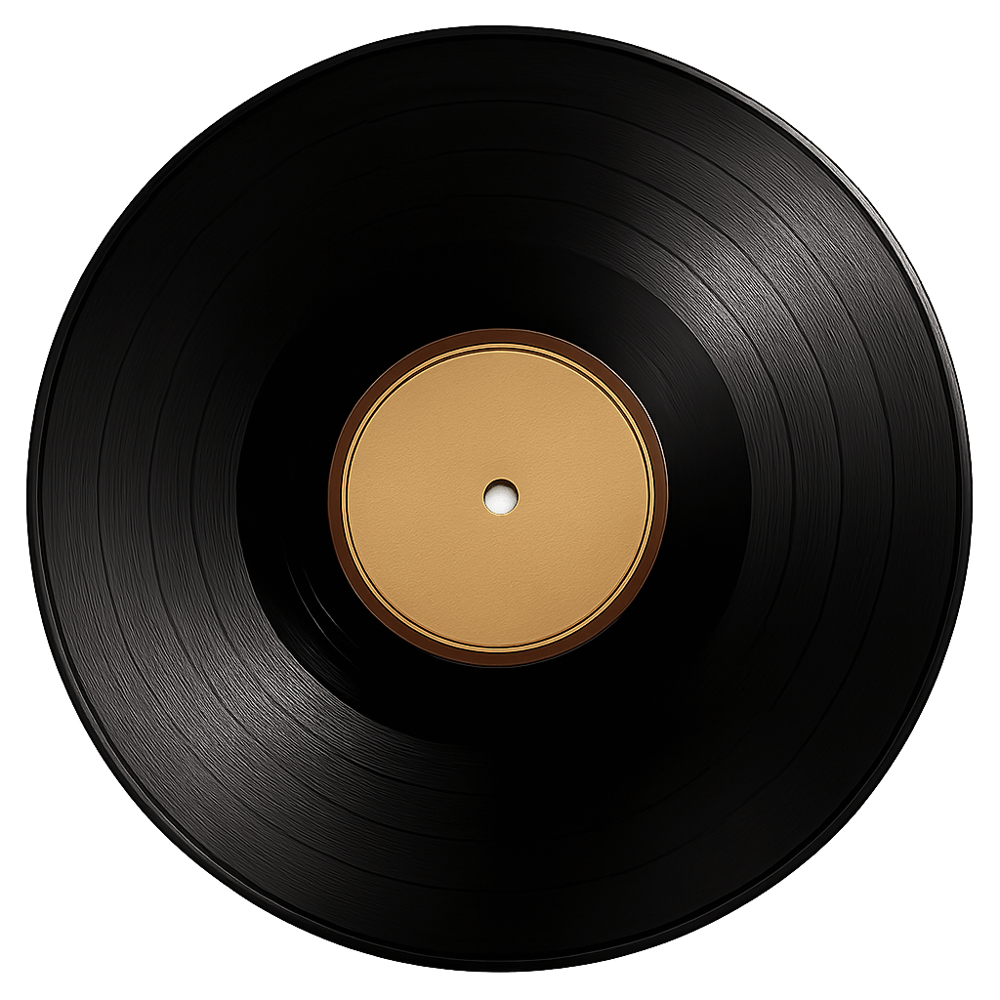

# 🎶 The Retro Gramophone 🎶

A beautiful, interactive music player designed to bring the magic of classic tunes to the grandparents we love. Built with ❤️, and now available for everyone to share!

### 🚀 View the Live Site Here! 👉 (https://kool-k.github.io/The-Retro-Gramophone/) 

## The Story Behind the Music

This project started as a special 85th birthday gift for my Ajoba (grandfather). His lifelong love for old, classic melodies from the golden era inspired me to create a digital 'gramophone' where he could listen to his favorite songs with a simple, nostalgic interface.

The joy it brought him was infectious! It made me realize that this could be a wonderful gift for many other parents, grandparents, and lovers of retro music. So, I've cleaned it up and turned it into a template for anyone to use, customize, and share with their own music-loving family and friends!

## ✨ Features

* **Stunning Vintage Design:** A beautiful, atmospheric interface that brings back the charm of a bygone era.
* **Fully Interactive:** Drag a record onto the gramophone to play a song!
* **Seamless Mobile Experience:** Works beautifully on phones and tablets with a smooth "drag-and-scroll" interface.
* **Easily Customizable:** No complex coding required! Easily add your own collection of songs with simple changes to one file.
* **Lightweight & Fast:** Built with pure HTML, CSS, and JavaScript. No heavy frameworks needed.

## 🚀 How to Create Your Own Gramophone

Making this project your own is super easy! Just follow these three steps.

### Step 1: Get the Files
Download or clone this repository to your computer.

### Step 2: Add Your Music Tracks
Inside the project folder, you'll find a folder named `music`. This is where you'll put all your `.mp3` song files.

For the best results, name your files something simple and web-friendly (e.g., `lag-jaa-gale.mp3`).

```bash
your-project-folder/
└── music/
    ├── your-first-song.mp3
    ├── your-second-song.mp3
    └── ... and so on

```

### Step 3: Update the Song List in index.html
Now, open the index.html file in your code editor. Scroll down to the record-rack section. You will see a list of record-item divs. Each one represents a song.

To change a song, simply edit these three parts of a record-item:

data-song: The path to your music file.

data-label: The song's title (the script uses this for the "Now Playing" text).

The text inside the <span>: The song's title that is visually displayed in the list.

```

<div class="record-item" data-song="music/your-song-filename.mp3" data-label="Your Song Title">
    
    <span class="record-label">Your Song Title</span>
</div>

```
That's it! You can add, remove, or change as many songs as you like.

## 🛠️ Tech Stack

* **HTML5:** For the core structure.
* **CSS3:** For all the beautiful styling and animations.
* **JavaScript:** To power the interactive music player.
* **SortableJS:** A fantastic library for the smooth, touch-friendly drag-and-drop functionality.

## 💖 Share the Love

This project is open-source. Feel free to use it, share it, and modify it for any personal or non-commercial use. A little credit back to this repository would be lovely, but it's not required :)

The main goal is to spread the joy of music!
Made with love, in the hope that it brings a smile to someone's face. Enjoy the music! 🎵